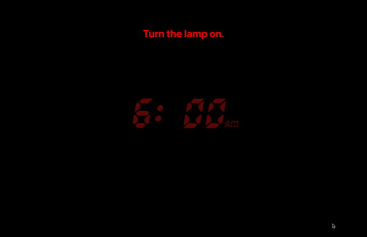
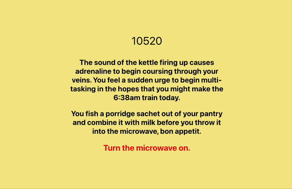

# CARBON OUTPUT
## Project 4 - SEI - General Assembly
This was our final project for our Software Engineering Bootcamp course at General Assembly. For this project, I decided to build an app that gives a real time visualisation of the amount of carbon dioxide produced by common household appliances, along with a quick narration to compliment the data.

[Check it out here!](google.com)

The main focus of this project was to demonstrate proper use of APIs to manipulate and display on the page, along with the use of React's useEffect to re-render a ticker on the page after each state change.

## Demonstration

The beginning of the narration describes an individual waking up to an alarm clock in the morning, as soon as the lamp is turned on, a ticker keeps track of the amount of carbon dioxide released into the atmosphere.

As you progress throughout the day, the amount of carbon dioxide you are producing increases, along with the rate for each appliance that is switched on.

## Planning

### 1 - Wireframing

First, I wrote up a wireframe of what I initially wanted to achieve with the project. Initially this was a page where appliances could be turned on and off from a list on the landing page, but I opted for a more simplimistic presentation.

### 2 - API Request/useEffect Hook

I used axios POST requests to calculate the amount of milligrams of carbon dioxide produced every half second. This was then added to the 'rate' state, which then updated a 'carbon counter' every half second and re-rendered this every half second through the useEffect hook.

### 3 - React Router DOM

A different route was used for each appliance, which, by clicking 'turn on X appliance', a new POST request is made.

## Technologies Used
* React
* Axios
* CSS
* JavaScript
* Node
* GitHub
* Heroku